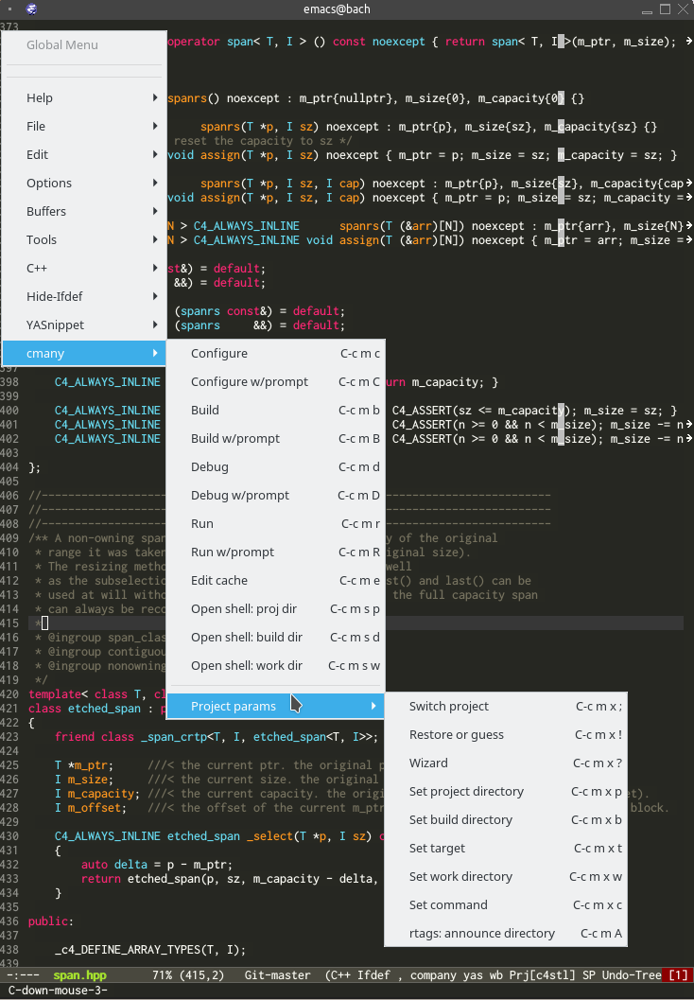

[](https://img.shields.io/badge/License-MIT-green.svg)
# cmany.el

With editing, compilation, debugging, build selection and persistent project
data, `cmany.el` turns emacs into something of a fully-fledged C/C++ IDE.

`cmany.el` is an emacs package providing integration
for [cmany](https://github.com/biojppm/cmany). `cmany.el` enables you to
interact with cmany in emacs to configure, build, run and debug your CMake
C/C++ project with the parameters of your choice. You can also use cmany's
powerful batch build facilities for CMake, which empower you to compile as
many builds as you like.

If you use [rtags](https://github.com/Andersbakken/rtags) to enable
clang-driven source intelligence, `cmany.el` will automatically announce your
current build directory to `rtags` (assuming the `-E` flag was used with
cmany so that cmake is instructed to create `compile_commands.json`).

`cmany.el` has two main groups of macros: project commands and project setup:

[](menu.png)


## Macros and bindings

`cmany.el` provides the following macros; their names should be fairly self
explaining:

```elisp
(defvar cmany-mode-map
   (let ((map (make-sparse-keymap)))

     ;; macros to setup project and build parameters for cmany.el
     (define-key map (kbd "C-c m x ;") 'cmany-switch-proj)
     (define-key map (kbd "C-c m x !") 'cmany-restore-or-guess)
     (define-key map (kbd "C-c m x ?") 'cmany-wizard)
     (define-key map (kbd "C-c m x p") 'cmany-set-proj-dir)
     (define-key map (kbd "C-c m x b") 'cmany-set-build-dir)
     (define-key map (kbd "C-c m x w") 'cmany-set-work-dir)
     (define-key map (kbd "C-c m x t") 'cmany-set-target)
     (define-key map (kbd "C-c m x c") 'cmany-set-cmd)

     ;; announce the chosen cmany-build-dir to rtags
     (define-key map (kbd "C-c m A") 'cmany-rtags-announce-build-dir)

     ;; macros to build and project
     (define-key map (kbd "C-c m c") 'cmany-configure)
     (define-key map (kbd "C-c m C") 'cmany-configure-with-prompt)
     (define-key map (kbd "C-c m b") 'cmany-build)
     (define-key map (kbd "C-c m B") 'cmany-build-with-prompt)
     (define-key map (kbd "C-c m d") 'cmany-debug)
     (define-key map (kbd "C-c m D") 'cmany-debug-with-prompt)
     (define-key map (kbd "C-c m r") 'cmany-run)
     (define-key map (kbd "C-c m R") 'cmany-run-with-prompt)

     ;; edit the cmake cache
     (define-key map (kbd "C-c m e") 'cmany-edit-cache)

     ;; open shell at different project dirs
     (define-key map (kbd "C-c m s p") 'cmany-shell-at-proj)
     (define-key map (kbd "C-c m s b") 'cmany-shell-at-build)
     (define-key map (kbd "C-c m s w") 'cmany-shell-at-work) ;; at workdir

     map)
   "Key map for the Emacs Lisp cmany environment."
   )
```


## Setup

This is the part I'm hesitating the most at, and I haven't yet got to a setup
workflow which feels solid and satisfying. This part still needs work. (This
is my first elisp project, and probably this part is where it shows the most).

For now I'm doing the following. First, clone the repo:

```bash
cd ~/.emacs.d
git clone https://github.com/biojppm/cmany.el
```

Then, in my emacs config, I have:

```elisp
(add-to-list 'load-path (concat emacs-dir "cmany.el"))
(load "cmany")
```

Then when I open a file belonging to a project, I explicitly invoke `M-x
global-cmany-mode`. cmany will try to find out what project this is
([projectile helps here](https://github.com/bbatsov/projectile)), and if it
finds a previous setting stored for this project, takes these.

When this fails, most of the time explicitly invoking `M-x cmany-wizard`
(shortcut `C-c m x ?`) solves any existing issue. In fact, you can probably
skip the `M-x global-cmany-mode` call and just live with calls to
`M-x cmany-wizard`. `cmany-wizard` interactively prompts you for the project
directory, the cmany command arguments, the build directory, the work
directory and current target. To make things practical, `cmany.el` uses
`ido` in these interactive prompts. There are also macros (see above) to
set each of these parameters separately.


## Requirements

`cmany.el` uses the following programs:

* Required
    * emacs!
    * [CMake](https://cmake.org/download/)
    * [cmany](https://github.com/biojppm/cmany)
* Advised
    * clang
    * [rtags](https://github.com/Andersbakken/rtags)

`cmany.el` requires the following emacs packages:

* Required
    * `ido`
    * `term-run`
* Advised
    * `projectile`
    * `rtags.el`


## License

`cmany.el` is permissively licensed under the MIT license.

